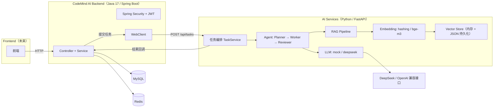

# CodeMind AI

AI 代码审查平台。Java 业务后端 + Python AI 服务两个子系统，通过 HTTP + 回调协作。

## 1. 项目介绍

CodeMind AI 是一个 AI 代码审查平台。用户上传代码、创建审查任务，系统调用大模型对代码进行安全、设计、性能等方面的审查，产出结构化审查报告。

解决的问题：

- 代码审查依赖人工，效率低、覆盖不全。
- 审查标准不统一，问题发现依赖个人经验。
- 大模型直接读代码缺少上下文，需要检索增强（RAG）提高相关性。

系统分两个服务：

- **CodeMind AI Backend**（Java / Spring Boot）：业务系统，负责用户、权限、项目、文件、任务与结果管理。
- **AI Services**（Python / FastAPI）：AI 执行服务，负责 Agent 工作流、RAG、Embedding、LLM 调用。

## 2. 系统架构



**为什么 Java 和 Python 分离**

- 业务系统（认证、权限、项目、文件、任务管理）是典型的 CRUD + 事务 + 权限场景，Java / Spring 生态（Spring Security、MyBatis-Plus、事务管理）更合适。
- AI 执行（Agent、RAG、Embedding、LLM）依赖 Python 生态（sentence-transformers、OpenAI SDK），Python 侧实现更直接。
- 两者通过 HTTP 异步解耦：Java 提交任务后立即返回，Python 后台执行完成后回调 Java 保存结果，互相不阻塞。

## 3. 技术栈

### Backend

- Spring Boot 4.1.1（Java 17）
- MyBatis-Plus 3.5.16
- MySQL
- Redis
- Spring Security + JWT（jjwt 0.12.6）
- WebClient（WebFlux）调用 FastAPI

### AI Service

- FastAPI + uvicorn
- Agent（Planner / Worker / Reviewer）
- RAG（文件加载、切片、检索）
- Embedding（hashing 特征哈希 / bge-m3 语义向量）
- LLM（mock / DeepSeek，OpenAI 兼容接口）

## 4. 核心功能

- **用户系统**：注册、登录、刷新令牌、登出、当前用户信息。
- **权限系统**：RBAC（ADMIN / USER 角色），方法级 `@PreAuthorize` 权限控制。
- **项目管理**：创建、分页查询、详情、修改、逻辑删除。
- **代码文件管理**：上传、分页查询、详情、逻辑删除。
- **AI 任务管理**：创建、分页查询、详情、状态机流转、结果保存。
- **AI 审查结果**：保存、分页查询、详情。

## 5. AI 任务执行流程

```
用户提交代码
    ↓
创建 AI 任务（状态 WAITING）
    ↓
WebClient 提交 FastAPI（POST /api/tasks）
    ↓
FastAPI 接收，立即返回 PROCESSING，后台异步执行
    ↓
Agent 执行（Planner → Worker → Reviewer）
    ↓
RAG 检索代码（CODE_REVIEW 任务）
    ↓
LLM 分析
    ↓
Callback 回调 Java（POST /api/ai/task/callback）
    ↓
Java 更新任务状态 + 保存审查结果
```

## 6. RAG 设计

```
代码解析（CodeLoader，按扩展名识别语言）
    ↓
文本切片（CodeSplitter，按 class / method 结构切分）
    ↓
Embedding（hashing 特征哈希 或 bge-m3 语义向量）
    ↓
Vector Search（余弦相似度）
    ↓
Context 增强（检索命中的代码块注入 Prompt）
    ↓
LLM Review（基于真实代码上下文生成审查报告）
```

Embedding 提供方：

- `hashing`（默认）：本地特征哈希，无外部依赖、离线可用。
- `bge-m3`：sentence-transformers 语义模型，支持中文需求 ↔ 英文代码跨语言检索。

向量存储为进程内余弦相似度检索 + JSON 文件持久化，非外部向量数据库服务。

## 7. Agent 设计

Agent 工作流为明确线性流程，无自主循环：

- **Planner**：将任务拆解为有序子步骤（输出 JSON steps）。
- **Worker**：逐个执行子步骤。优先匹配注册的工具（默认无工具注册），否则调用 LLM，并注入 RAG 检索到的上下文。
- **Reviewer**：审核执行结果，产出结构化审查报告（approved / summary / issues，级别 P0 / P1 / P2）。

## 8. 项目启动

### 8.1 Backend（本地）

```bash
cd "CodeMind AI Backend"
./gradlew bootRun
```

需先准备 MySQL、Redis，并执行 `src/main/resources/schema.sql` 建表，配置环境变量（见下）。

### 8.2 AI Service（本地）

```bash
cd "AI Services"
python -m venv .venv
.venv/Scripts/activate           # Windows；Linux/macOS 用 source .venv/bin/activate
pip install -r requirements.txt
uvicorn app.main:app --reload --host 0.0.0.0 --port 8000
```

默认监听 8000 端口，健康检查 `GET /health`。

### 8.3 Backend（Docker）

多阶段构建：Stage 1 用 `gradle:9.5.1-jdk17` 打 fat jar，Stage 2 用 `eclipse-temurin:17-jre` 运行。敏感配置全部通过环境变量注入，镜像内无写死的密码 / secret。

```bash
cd "CodeMind AI Backend"
cp ../.env.example .env   # 填写 DB_PASSWORD / JWT_SECRET / INTERNAL_SECRET 等
docker build -t codemind-backend .
# 或一键编排 MySQL + Redis + App：
docker compose up -d --build
docker compose ps
docker compose logs -f app
docker compose down     # 停止并移除容器
docker compose down -v  # 连带清空数据卷（谨慎）
```

> 说明：容器内 `localhost` 指向容器自身。开发环境本机 MySQL/Redis/FastAPI 用 `host.docker.internal` 访问（Docker Desktop Windows/Mac 支持）；生产环境改为实际服务地址或容器网络。

### 8.4 AI Service（Docker）

```bash
cd "AI Services"
cp ../.env.example .env   # 填写 DEEPSEEK_API_KEY / CALLBACK_URL 等
docker compose up -d --build
docker compose logs -f
```

bge-m3 模型走外部目录挂载（`./models/bge-m3` → 容器内 `/models/bge-m3`），不打进镜像。torch 用 CPU 构建，避免 PyPI 默认 CUDA 版拉取多 GB `nvidia_*` 依赖。

## 9. 环境配置

环境变量统一由根目录 `.env.example` 提供单一占位模板，覆盖两个服务：

- **MySQL / Redis**：`DB_*`、`REDIS_*`
- **服务地址**：`SERVER_PORT`、`AI_SERVICE_URL`、`CALLBACK_URL`
- **安全**：`JWT_SECRET`、`INTERNAL_SECRET`
- **管理员初始化**：`ADMIN_USERNAME`、`ADMIN_PASSWORD`
- **LLM**：`LLM_PROVIDER`、`DEEPSEEK_API_KEY`、`DEEPSEEK_BASE_URL`、`DEEPSEEK_MODEL`、`PROMPTS_DIR`
- **RAG / 向量**：`EMBEDDING_PROVIDER`、`EMBEDDING_MODEL_NAME`、`EMBEDDING_DIM`、`CHUNK_SIZE`、`CHUNK_OVERLAP`、`VECTORSTORE_PATH`、`CODE_VECTORSTORE_PATH`、`RAG_DOCS_DIR`、`RAG_TOP_K`、`RAG_MIN_SCORE`、`CODE_REVIEW_DIR`、`CODE_REVIEW_QUERY`
- **回调**：`CALLBACK_URL`、`CALLBACK_TIMEOUT`、`CALLBACK_RETRIES`、`CALLBACK_RETRY_DELAY`
- **应用**：`APP_ENV`、`LOG_LEVEL`
- **Docker 端口映射**：`MYSQL_HOST_PORT`、`REDIS_HOST_PORT`、`APP_HOST_PORT`

Java 侧通过 `${VAR}` 占位符读取环境变量；Python 侧通过 pydantic-settings 读取 `.env` 与系统环境变量（环境变量优先）。

## 10. 项目亮点

- Java 业务系统与 AI Service 解耦，通过 HTTP 异步 + 回调协作。
- 异步任务模型：任务提交后立即返回，后台线程池执行，回调落库。
- RAG 增强代码理解：结构感知的代码切片 + 向量检索，让 LLM 基于真实代码上下文审查。
- 企业级权限设计：RBAC + JWT + 方法级权限控制 + 内部服务 HMAC 鉴权。
- 多提供方抽象：LLM（mock / deepseek）与 Embedding（hashing / bge-m3）均可配置切换。
- 双服务 Docker 化：Backend 多阶段构建，AI Service 模型外置挂载，配置全部环境变量注入。

## 文档

- [docs/architecture.md](docs/architecture.md) — 系统架构
- [docs/database-design.md](docs/database-design.md) — 数据库设计
- [docs/ai-workflow.md](docs/ai-workflow.md) — AI 执行流程
- [docs/api-design.md](docs/api-design.md) — 接口设计
- [docs/deployment.md](docs/deployment.md) — 部署与启动
