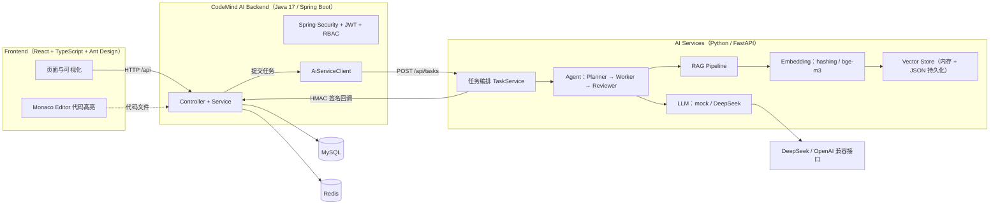

# CodeMind-AI

AI 驱动的智能代码审查平台。

前端（React）负责交互与结果可视化，Java 后端（Spring Boot）负责业务、权限与任务编排，Python 服务（FastAPI）负责 Agent、RAG 与 LLM 调用。三者通过 HTTP + 异步回调解耦，Docker Compose 一键部署。

---

## 项目介绍

CodeMind-AI 是一个完整的 AI 应用系统：用户上传代码、创建审查任务，系统通过 RAG 检索真实代码上下文，再由 LLM 对代码进行安全、设计、性能等多维度审查，最终产出结构化、可定位到具体代码行的审查报告。

**解决什么问题**

- 人工代码审查效率低、耗时长，大型项目难以做到全覆盖。
- 审查标准因人而异，问题发现依赖个人经验，质量不稳定。
- 大模型直接读代码缺乏项目上下文，容易出现“泛泛而谈”、定位不准的问题。

**为什么需要**

- 需要一个把「业务管理」与「AI 执行」分开的系统：业务侧做认证、权限、项目与文件管理，AI 侧做检索增强与模型调用。
- 需要 RAG 让模型基于真实代码说话，而不是凭空生成。
- 需要结果可视化，把 AI 输出的问题直接映射到代码行，方便开发者快速定位。

---

## 系统架构



**为什么 Java 与 Python 分离**

- 业务系统（认证、权限、项目、文件、任务管理）是典型的 CRUD + 事务 + 权限场景，Java / Spring 生态（Spring Security、MyBatis-Plus、事务管理）更合适。
- AI 执行（Agent、RAG、Embedding、LLM）依赖 Python 生态（sentence-transformers、OpenAI SDK），Python 侧实现更直接。
- 两者通过 HTTP 异步解耦：Java 提交任务后立即返回，Python 后台执行完成后通过带 HMAC 签名的回调把结果写回 Java，互相不阻塞。

---

## 核心功能

- **用户认证**：注册、登录、刷新令牌、登出、当前用户信息，基于 JWT。
- **RBAC 权限**：ADMIN / USER 两级角色，方法级 `@PreAuthorize` 权限控制，管理员可管理用户、重置密码、分配角色。
- **项目管理**：项目创建、分页查询、详情、修改、逻辑删除。
- **代码文件管理**：代码上传、下载、分页查询、详情、逻辑删除。
- **AI 任务管理**：任务创建、分页查询、详情、状态机流转、取消、超时兜底。
- **AI 代码审查**：提交代码后由 Agent 工作流 + RAG 检索上下文 + LLM 生成多维审查结论。
- **结果可视化**：审查结果分页查询与详情，问题按级别（P0 / P1 / P2）展示，前端 Monaco Editor 高亮定位到具体代码行。

---

## AI 能力

### Agent

Agent 工作流为**明确的三步线性流程，无自主循环**，可控、可中断：

- **Planner**：把任务拆解为有序子步骤（输出 JSON steps）。
- **Worker**：逐步执行子步骤，调用 LLM 时注入 RAG 检索到的代码上下文。
- **Reviewer**：审核执行结果，产出结构化审查报告（approved / summary / issues，级别 P0 / P1 / P2），通过与否决定任务最终状态。

### RAG

```
代码解析（CodeLoader，按扩展名识别语言）
    ↓
文本切片（CodeSplitter，按 class / method 结构切分）
    ↓
Embedding（hashing 特征哈希 或 bge-m3 语义向量）
    ↓
Vector Search（余弦相似度）
    ↓
Context 增强（命中的代码块注入 Prompt）
    ↓
LLM Review（基于真实代码上下文生成审查报告）
```

### Embedding

- `hashing`（默认）：本地特征哈希 + L2 归一化，无外部依赖、离线可用。
- `bge-m3`：sentence-transformers 语义模型，支持中文需求 ↔ 英文代码的跨语言检索。

### Vector Search

向量存储为**进程内余弦相似度检索 + JSON 文件持久化**，非外部向量数据库服务。支持通用文档检索（`RAG_DOCS_DIR`）与代码检索（`CODE_REVIEW_DIR`）两套向量库，分别配置 top_k 与相似度阈值。

### LLM

- `deepseek`：DeepSeek（OpenAI 兼容接口）。
- `mock`：本地联调，不调用真实模型。

### 真实流程（CODE_REVIEW 任务）

1. 前端创建任务，后端落库后调用 FastAPI `POST /api/tasks`。
2. FastAPI 立即返回 `PROCESSING`，后台线程池异步执行。
3. 执行前重建代码向量库，按固定查询（“分析代码中的安全问题、设计问题、性能问题”）检索相关代码块。
4. Agent 三步工作流（Planner → Worker → Reviewer）结合检索上下文与 LLM 生成结论。
5. 结果通过带 HMAC 签名的回调 `POST /api/ai/task/callback` 写回 Spring Boot。
6. 后端更新任务状态、保存审查结果；前端 Result 页可视化展示并高亮定位。

---

## 技术栈

**Frontend**

- React 18
- TypeScript
- Ant Design 5
- Vite
- Zustand
- Axios
- React Router 6
- Monaco Editor

**Backend**

- Spring Boot 4.1.1（Java 17）
- MyBatis-Plus
- MySQL 8
- Redis 7
- Spring Security + JWT

**AI**

- FastAPI
- OpenAI 兼容客户端（DeepSeek）
- sentence-transformers（bge-m3）
- 自研 Agent 工作流 + RAG 框架

**Deployment**

- Docker Compose（mysql + redis + backend + ai-service + frontend 一键编排）

---

## 项目结构

```
CodeMind-AI/
├── frontend-react/             # React 前端（Vite + Ant Design）
│   ├── src/
│   │   ├── pages/              # 页面：Login / Dashboard / Project / File / Task / Result
│   │   ├── components/         # 组件：CodeViewer（Monaco）/ layout / Dashboard
│   │   ├── api/                # Axios 封装 + 各模块接口
│   │   └── router/             # 路由（Result / File 懒加载）
│   ├── Dockerfile              # 多阶段：node build → nginx serve
│   └── nginx.conf              # SPA 回退 + /api 反代 backend
├── CodeMind AI Backend/        # Spring Boot 后端（Java 17）
│   └── src/main/java/.../
│       ├── controller/         # Auth / Project / File / AiTask / AiReviewResult / User / Role
│       ├── service/            # 业务层 + impl
│       ├── mapper/             # MyBatis-Plus Mapper
│       ├── entity/ dto/ vo/    # 实体 / 入参 / 出参
│       ├── security/           # JWT + RBAC + 内部服务 HMAC 鉴权
│       └── config/             # 配置 + AdminInitializer（种子账号）
├── AI Services/                # FastAPI AI 服务（Python）
│   ├── app/
│   │   ├── agents/             # Planner / Worker / Reviewer 工作流
│   │   ├── rag/                # 加载、切片、检索
│   │   ├── embeddings/         # hashing / bge-m3
│   │   ├── vectorstore/        # 向量存储
│   │   ├── services/           # 任务编排、回调、LLM
│   │   ├── prompts/            # Prompt 模板（YAML）
│   │   └── api/                # /api/tasks
│   └── Dockerfile
├── docs/                       # 设计文档（架构 / 数据库 / AI 流程 / 接口 / 部署）
├── codes/                      # 代码评审共享目录（运行时产物，不入库）
├── docker-compose.yml          # 总控编排（一键启动全部服务）
├── .env.example                # 环境变量单一模板
└── README.md
```

---

## 快速启动

### 环境要求

**Docker 方式（推荐）**

- Docker
- Docker Compose

**本地开发方式**

- Java 17
- Python 3.10+
- Node.js 18+
- MySQL 8
- Redis 7

### 配置 .env

```bash
cp .env.example .env
```

编辑 `.env`，填写真实值（**禁止提交真实值，`.env` 已被 gitignore**）：

- `DB_PASSWORD`：MySQL 密码
- `JWT_SECRET`：JWT 签名密钥（≥32 字节）
- `INTERNAL_SECRET`：Java ↔ Python 内部服务 HMAC 签名密钥
- `ADMIN_PASSWORD`：管理员种子账号密码（首次启动自动创建）
- `DEEPSEEK_API_KEY`：DeepSeek API Key（`LLM_PROVIDER=deepseek` 时必填）

### docker compose up

```bash
docker compose up -d --build
docker compose ps                  # 查看服务状态
docker compose logs -f backend     # 查看后端日志
docker compose down                # 停止并移除容器（保留数据卷）
docker compose down -v             # 连带删除数据卷（谨慎）
```

启动后服务与端口：

| 服务 | 容器 | 端口 |
| --- | --- | --- |
| 前端（Nginx） | codemind-frontend | 80 |
| 后端（Spring Boot） | codemind-backend | 8080 |
| AI 服务（FastAPI） | codemind-ai-service | 8000 |
| MySQL | codemind-mysql | 3306 |
| Redis | codemind-redis | 6379 |

> 端口冲突时，通过 `.env` 中的 `FRONTEND_HOST_PORT` / `APP_HOST_PORT` / `AI_HOST_PORT` / `MYSQL_HOST_PORT` / `REDIS_HOST_PORT` 调整映射。

---

## Demo 流程

5 分钟快速体验：

1. **启动**：`docker compose up -d --build`，等待各服务 healthy。
2. **登录**：浏览器打开 `http://localhost`，用种子账号 `admin`（`ADMIN_PASSWORD` 配置的密码）登录。
3. **建项目**：进入「项目」页，新建一个项目。
4. **传代码**：进入「文件」页，上传待审查的代码文件。
5. **建任务**：进入「任务」页，创建 `CODE_REVIEW` 类型的任务。
6. **看结果**：任务完成后进入「结果」页，查看问题列表，点击问题可跳转 Monaco 编辑器高亮定位到对应代码行。

> 本地联调时可将 `LLM_PROVIDER=mock`，跳过真实模型调用，快速跑通全流程。

---

## Screenshots

<!-- 截图占位：登录页 -->
<!-- 截图占位：项目 / 文件管理 -->
<!-- 截图占位：AI 任务列表 -->
<!-- 截图占位：审查结果可视化（Monaco 高亮定位） -->

---

## 设计亮点

- **企业级分层**：controller / service / mapper / entity 分层，dto / vo 分离入参出参，统一 `Result<T>` 响应与全局异常处理。
- **JWT 认证**：无状态认证 + 刷新令牌，Spring Security 集成，方法级权限控制。
- **AI 服务解耦**：Java 与 Python 通过 HTTP 异步协作，任务提交即返回，后台执行 + HMAC 签名回调，互不阻塞。
- **RAG 代码检索**：结构感知的代码切片 + 向量检索，让 LLM 基于真实代码上下文审查；bge-m3 支持中文需求 ↔ 英文代码跨语言检索。
- **Docker 部署**：多服务多阶段构建，模型外置挂载、配置全环境变量注入，一键编排。

---

## Future Roadmap

- **可观测性**：接入指标采集（metrics）、结构化日志与链路追踪，完善监控告警。
- **任务队列**：将线程池执行升级为消息队列（如 Redis Stream / RabbitMQ），支持任务重试、削峰与横向扩容。
- **多模型支持**：抽象模型网关，接入更多 LLM 提供方与本地模型。
- **代码仓库接入**：支持从 Git 仓库直接拉取代码进行审查，减少手动上传。

---

## License

[MIT](LICENSE)

MIT License

Copyright (c) 2026 CodeMind-AI

Permission is hereby granted, free of charge, to any person obtaining a copy
of this software and associated documentation files (the "Software"), to deal
in the Software without restriction, including without limitation the rights
to use, copy, modify, merge, publish, distribute, sublicense, and/or sell
copies of the Software, and to permit persons to whom the Software is
furnished to do so, subject to the following conditions:

The above copyright notice and this permission notice shall be included in all
copies or substantial portions of the Software.

THE SOFTWARE IS PROVIDED "AS IS", WITHOUT WARRANTY OF ANY KIND, EXPRESS OR
IMPLIED, INCLUDING BUT NOT LIMITED TO THE WARRANTIES OF MERCHANTABILITY,
FITNESS FOR A PARTICULAR PURPOSE AND NONINFRINGEMENT. IN NO EVENT SHALL THE
AUTHORS OR COPYRIGHT HOLDERS BE LIABLE FOR ANY CLAIM, DAMAGES OR OTHER
LIABILITY, WHETHER IN AN ACTION OF CONTRACT, TORT OR OTHERWISE, ARISING FROM,
OUT OF OR IN CONNECTION WITH THE SOFTWARE OR THE USE OR OTHER DEALINGS IN THE
SOFTWARE.
