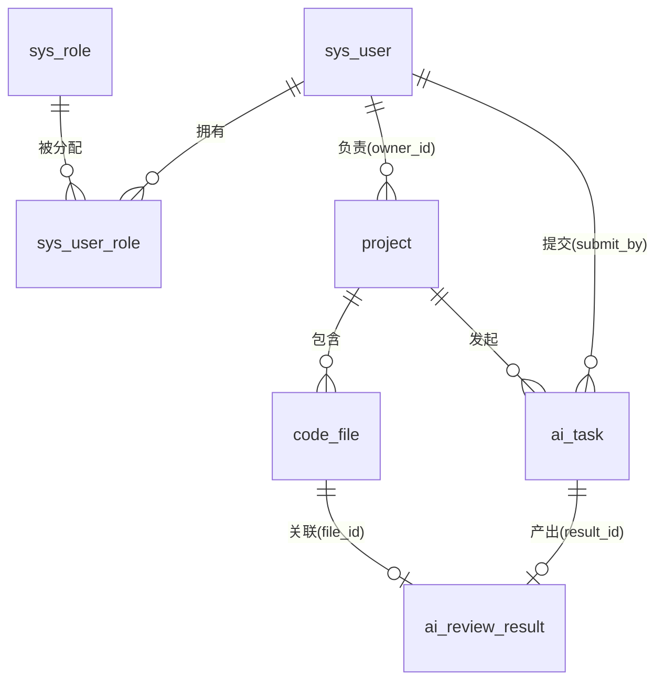

# 数据库设计

数据库脚本：`CodeMind AI Backend/src/main/resources/schema.sql`。

- 引擎 InnoDB，编码 utf8mb4。
- 主键为 BIGINT 雪花 ID（`IdType.ASSIGN_ID`）。
- 通用审计字段：`create_time` / `update_time` / `create_by` / `update_by`（由 MyBatis-Plus 自动填充）。
- 逻辑删除：`deleted`（0 未删，1 已删，`@TableLogic`）。

## 1. 表清单

| 表 | 说明 |
|----|------|
| `sys_user` | 用户表 |
| `sys_role` | 角色表 |
| `sys_user_role` | 用户-角色关联表 |
| `project` | 项目表 |
| `code_file` | 代码文件表 |
| `ai_task` | AI 任务表 |
| `ai_review_result` | AI 审查结果记录表 |

## 2. 表结构

### sys_user（用户表）

| 字段 | 类型 | 说明 |
|------|------|------|
| id | BIGINT | 主键 |
| username | VARCHAR(50) | 登录名，唯一键 `uk_username` |
| password | VARCHAR(100) | 密码密文（BCrypt） |
| nickname | VARCHAR(50) | 昵称 |
| email | VARCHAR(100) | 邮箱 |
| phone | VARCHAR(20) | 手机号 |
| avatar | VARCHAR(255) | 头像 URL |
| status | TINYINT | 1 启用 0 禁用 |
| deleted | TINYINT | 逻辑删除 |

### sys_role（角色表）

| 字段 | 类型 | 说明 |
|------|------|------|
| id | BIGINT | 主键 |
| role_code | VARCHAR(50) | 角色编码，唯一键 `uk_role_code` |
| role_name | VARCHAR(50) | 角色名 |
| description | VARCHAR(200) | 描述 |
| status | TINYINT | 1 启用 0 禁用 |

角色种子数据（`schema.sql` 内置）：

- `1` / `ADMIN` / 管理员
- `2` / `USER` / 普通用户

### sys_user_role（用户-角色关联表）

| 字段 | 类型 | 说明 |
|------|------|------|
| id | BIGINT | 主键 |
| user_id | BIGINT | 用户 ID |
| role_id | BIGINT | 角色 ID |

唯一键 `uk_user_role (user_id, role_id)`。

### project（项目表）

| 字段 | 类型 | 说明 |
|------|------|------|
| id | BIGINT | 主键 |
| name | VARCHAR(100) | 项目名 |
| description | VARCHAR(500) | 项目描述 |
| owner_id | BIGINT | 负责人用户 ID，索引 `idx_owner_id` |
| language | VARCHAR(50) | 主语言 |
| repo_url | VARCHAR(255) | 仓库地址 |
| status | TINYINT | 1 进行中 0 归档 |

### code_file（代码文件表）

| 字段 | 类型 | 说明 |
|------|------|------|
| id | BIGINT | 主键 |
| project_id | BIGINT | 所属项目 ID，索引 `idx_project_id` |
| file_name | VARCHAR(255) | 原始文件名 |
| file_path | VARCHAR(500) | 存储路径 / 相对路径 |
| file_type | VARCHAR(50) | 文件类型 |
| file_size | BIGINT | 字节数 |
| storage_url | VARCHAR(500) | 存储地址 |
| checksum | VARCHAR(64) | 校验和 |
| content | LONGTEXT | 文件内容（小文件直存） |
| status | TINYINT | 状态 |

### ai_task（AI 任务表）

| 字段 | 类型 | 说明 |
|------|------|------|
| id | BIGINT | 主键 |
| project_id | BIGINT | 所属项目 ID，索引 `idx_project_id` |
| task_type | VARCHAR(50) | 任务类型，如 CODE_REVIEW |
| status | TINYINT | 0 待处理 1 处理中 2 成功 3 失败 |
| params | TEXT | 请求参数 / 任务内容 JSON |
| result_id | BIGINT | 关联结果记录 ID |
| error_msg | VARCHAR(1000) | 失败原因 |
| submit_by | BIGINT | 提交人 ID |
| start_time | DATETIME | 开始时间 |
| end_time | DATETIME | 结束时间 |

### ai_review_result（AI 审查结果记录表）

| 字段 | 类型 | 说明 |
|------|------|------|
| id | BIGINT | 主键 |
| task_id | BIGINT | 关联任务 ID，索引 `idx_task_id` |
| project_id | BIGINT | 所属项目 ID，索引 `idx_project_id` |
| file_id | BIGINT | 关联代码文件 ID |
| review_type | VARCHAR(50) | 审查类型 |
| severity | VARCHAR(20) | 严重程度 |
| line_no | INT | 行号 |
| summary | VARCHAR(500) | 问题摘要 |
| detail | TEXT | 详细结果 JSON |
| status | TINYINT | 状态 |

## 3. 主要关系

- 用户与角色为多对多关系，通过 `sys_user_role` 关联。
- 一个项目对应多个代码文件、多个 AI 任务。
- 一个 AI 任务最多对应一条审查结果（`result_id`）。
- 数据隔离：普通用户仅能访问本人负责项目下的任务与文件（`project.owner_id` 校验）。
